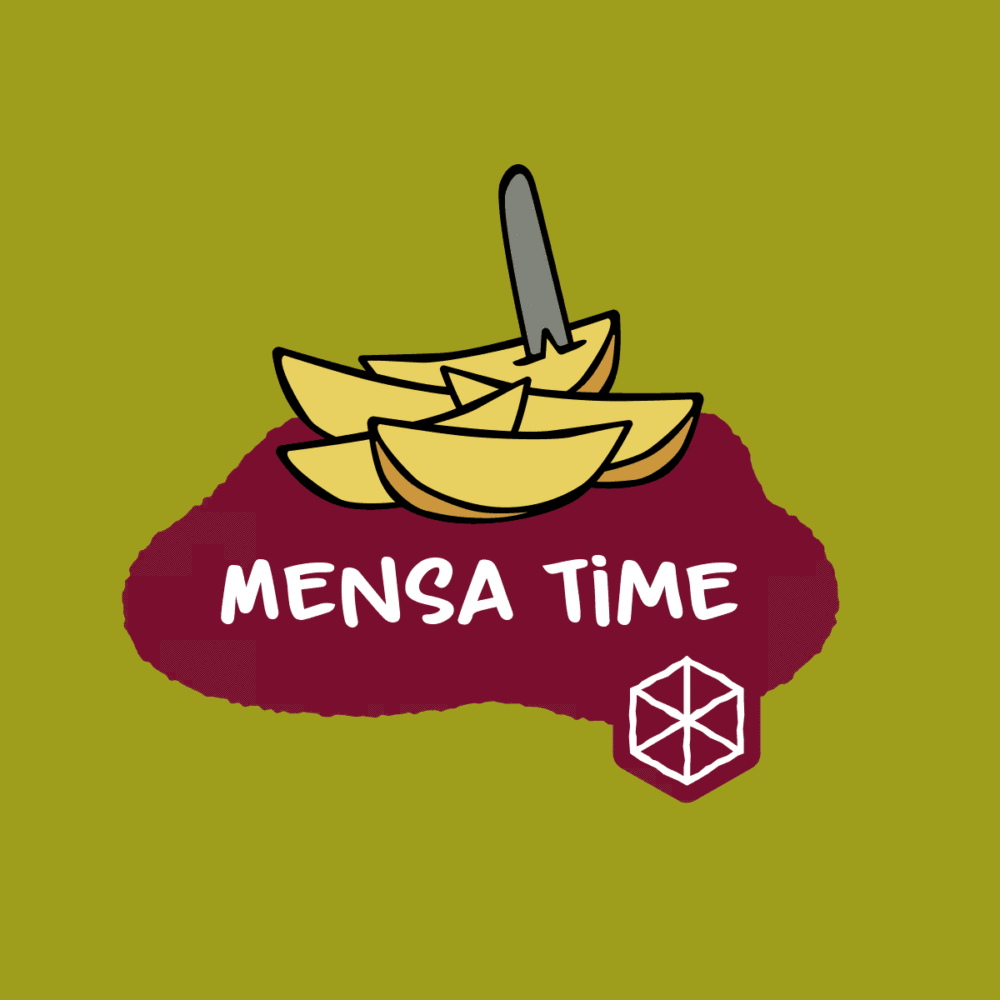

# ⚠️ STILL IN PROGRESS ⚠️
# Mensa-Mates

**Mensa-Mates** is a social web platfrom where students can rate, comment on, and explore university cafeteria (mensa) meals.
The goal is to make dining more interactiveand fun by sharing experiences with friends and building a collective archive of the best (and worst) meals.

## (Planned) Features
- User registration and login system
- Rate meals (0-22 scale)
- Settings
- Browse daily menus
- List of your favourite meals!

