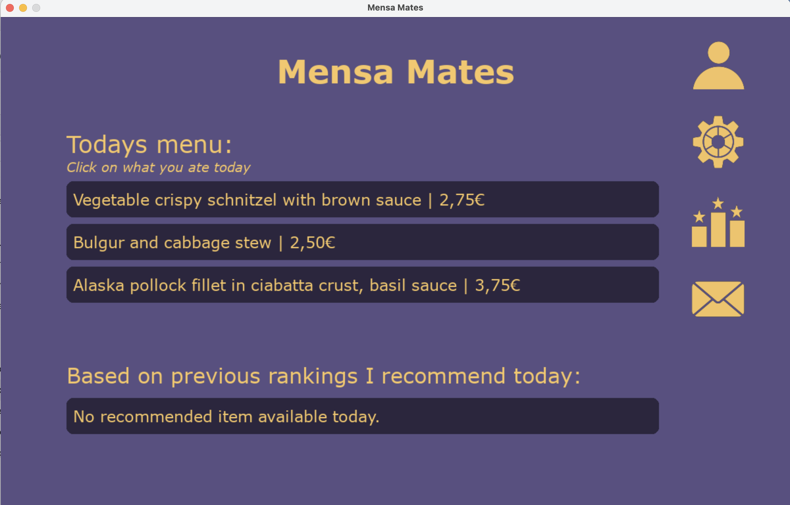

# 🍕 Mensa-Mates 🍕

**Mensa-Mates** is a social web platfrom where students can rate, comment on, and explore university cafeteria (mensa) meals.
The goal is to make dining more interactiveand fun by sharing experiences with friends and building a collective archive of the best (and worst) meals.

## Features
- User login system
- Rate meals (0-22 scale)
- Give individual thoughts on meals
- Browse daily menus
- Ranking of your favourite meals ever!

